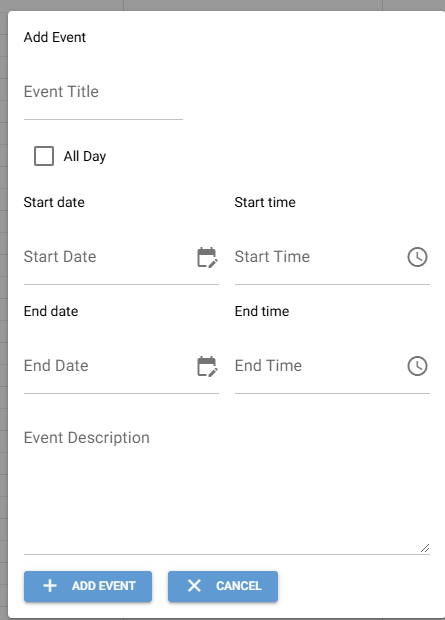
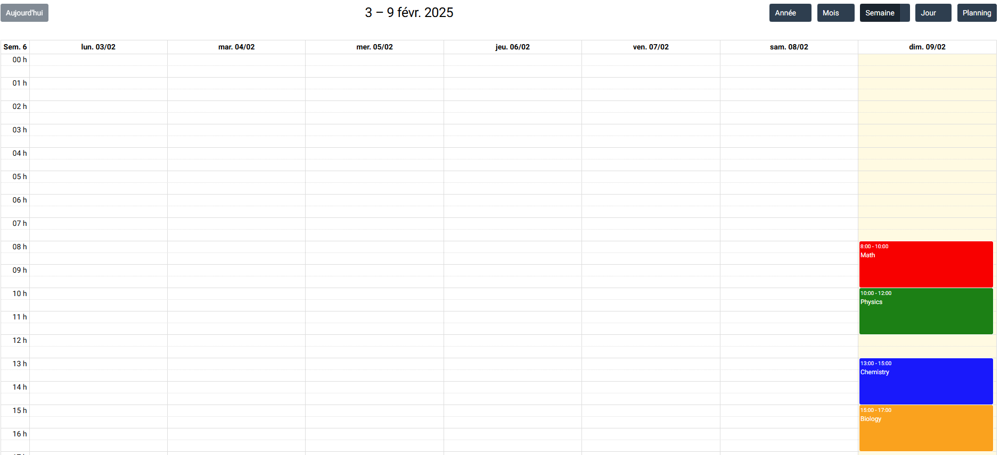
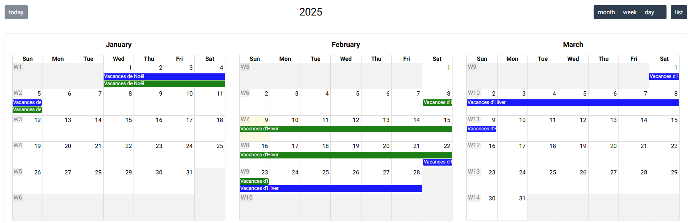

# NiceGui FullCalendar Example

**This example is designed for NiceGui with non-premium FullCalendar plugins enabled.**

## Plugins Used

- **@fullcalendar/daygrid**: Provides Month and DayGrid views: `dayGridYear`, `dayGridMonth`, `dayGridWeek`, `dayGridDay`, `dayGrid` (generic)
- **@fullcalendar/timegrid**: Provides TimeGrid views: `timeGridWeek`, `timeGridDay`, `timeGrid` (generic)
- **@fullcalendar/list**: Provides List views: `listYear`, `listMonth`, `listWeek`, `listDay`, `list` (generic)
- **@fullcalendar/multimonth**: Provides Multi-Month views: `multiMonthYear`, `multiMonth` (generic)
- **@fullcalendar/icalendar**: For loading events from an iCalendar feed

## Features

- **Event Creation Form**: A form to create events.
- **Date and Event Click Handling**: Some code to handle date clicks and event clicks.

## Instructions

1. Clone this repository.

## Code Example

An example code for event creation is present in the `main.py` file.

For handling .ics calendars, the code is present in the `main-ics.py` file.

## Screenshots

## Contributions

Contributions are welcome! Please submit a pull request or open an issue to discuss the changes you want to make.
